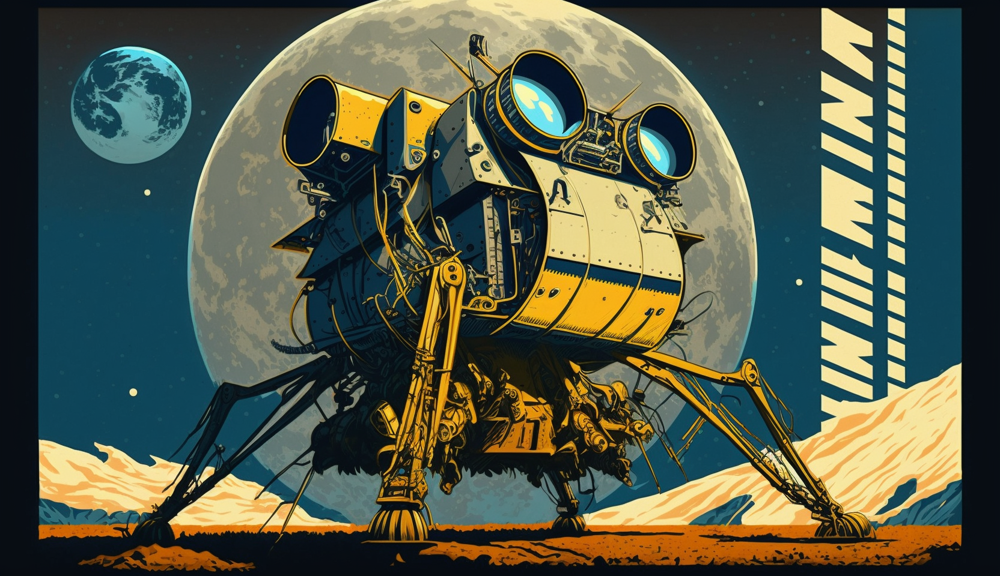

# Lunar Lander 🧑‍🚀🚀


Un *Coding Contest* en mode *Bot Battle*.

Qui arrivera à faire atterir son vaisseau le premier sans l'exploser ?

## Mise en place

Quelqu'un doit faire office de serveur, et doit le lancer sur sa machine.

```shell
cd server
npm install
npm start
```

- Vérifier que le serveur tourne bien en allant sur `http://localhost:4000`  
- Vérifiez que tous les clients peuvent accéder au serveur sur l'URL : `IP_DE_LA_MACHINE_SERVEUR:4000`
  - ℹ️ l'IP locale du serveur se trouve en bas à droite de la page

Ensuite, chaque client doit lancer son programme :
```shell
cd client
npm install
...
# penser à mettre à jour cette ligne en haut de app.ts
const SERVER_URL = process.env.SERVER_URL || 'http://127.0.0.1:4000';
...
npm run dev
```
L'application redémarrera automatiquement à chaque modification dans le code.

Chaque client peut customiser son vaisseau avec un nom, un [emoji](https://emojipedia.org/) et une [couleur](https://www.colorhexa.com/) : 

```javascript
const PLAYER_NAME = process.env.PLAYER_NAME || 'NO_NAME';
const PLAYER_EMOJI = process.env.PLAYER_EMOJI || '💩';
const PLAYER_COLOR = process.env.PLAYER_COLOR || 'FFFFFF';
```

## Comment jouer

Vous devez implémenter un algorithme qui permettra à votre vaisseau d'atterir sur la Lune sans exploser.  
Pour celà, votre vaisseau devra respecter une limite de vitesse et d'angle lorsqu'il touche le sol.  
Par défaut, ces valeurs sont `vx=40, vy=40, ang=15`.  
Au dessus, vous êtes dans la [DANGER ZONE](https://www.youtube.com/watch?v=siwpn14IE7E&ab_channel=KennyLogginsVEVO).  

Pour celà, il faudra compléter le callback de la fonction `io.handleLander()` dans `app.ts`.  
Votre callback doit retourner un objet `actions`, à vous de déterminer avec quelles valeurs.  

```javascript
const actions = {
    thrust: false,
    rotate: LanderRotation.NONE
}
```

## Télémétrie

### Données à envoyer au serveur

- `thrust` signifie "poussée", et détermine si le moteur principal doit s'allumer ou pas
- `rotate` signifie "tourner, pivoter", et détermine le sens dans lequel doit tourner le vaisseau
  - `CLOCKWISE` signifie "dans le sens des aiguilles d'une montre"
  - `COUNTERCLOCKWISE` signifie "dans le sens INVERSE des aiguilles d'une montre"
  - `NONE` signifie que le vaisseau ne doit pas tourner

### Données venant du serveur

- `angle` : l'angle de rotation du vaisseau
  - `0` si le vaisseau pointe vers le haut
  - `-90` si le vaisseau pointe vers la gauche
  - `90` si le vaisseau pointe vers la droite
  - `+/-180` si le vaisseau pointe vers le bas
- `vx` : vélocité horizontale
  - est **positive** lorsque le vaisseau se déplace vers la **droite**
  - est **négative** lorsque le vaisseau se déplace vers la **gauche**
- `vy` : vélocité verticale
  - est **positive** lorsque le vaisseau se déplace vers le **bas**
  - est **négative** lorsque le vaisseau se déplace vers le **haut**
- `va` : vélocité angulaire
  - est **positive** lorsque le vaisseau est en rotation vers la **droite**
  - est **négative** lorsque le vaisseau est en rotation vers la **gauche**
- `altitude` : distance entre le vaisseau et le sol
- `usedFuel` : la quantité de carburant utilisé lors de cette tentative
  - allumer un moteur auxiliaire (de rotation) consomme 1 de carburant par frame
  - allumer le moteur principal (de poussée) consomme 2 de carburant par frame 
- `status` : le statut actuel de votre vaisseau :
  - 0 : SPAWNED, votre vaisseau vient d'apparaître (ou de réapparaître) et est invulnérable quelques secondes
  - 1 : ALIVE, votre vaisseau est en cours de vol, tout va bien (pour le moment)
  - 2 : LANDED, votre vaisseau à atterri 🎉 ! Il réapparaîtra dans quelques secondes
  - 3 : DEAD, votre vaisseau à explosé 😱 ! Il réapparaîtra dans quelques secondes.
- `dangerStatus` : l'état de danger actuel de votre vaisseau :
  - 0 : SAFE, votre vaisseau est en sécurité (pour le moment)
  - 1 : BAD_ANGLE, l'angle d'inclinaison de votre vaisseau avec le sol est trop grand pour atterrir !
  - 2 : TOO_FAST, votre vaisseau va trop vite pour atterrir !

## Test de charge 

Voici une solution un peu nulle mais qui fonctionne pour lancer plein de clients en local :

```bash
# lancer ça pour pop 14 clients-pokémons, je suis pas expert en bash laissez moi tranquille
./run_load_test.sh
```

Voici un algo tout pété pour que les vaisseaux volent un peu mais pas trop :

```js
// Full random pour tester
actions.thrust = Math.random() < 0.5;
if (data.altitude > 800) {
    actions.thrust = false
}

actions.rotate = LanderRotation.NONE;
const rotateRand = Math.random();
if (rotateRand < 0.33) {
    actions.rotate = LanderRotation.CLOCKWISE;
} else if (rotateRand > 0.66) {
    actions.rotate = LanderRotation.COUNTERCLOCKWISE;
}
```

## Clients alternatifs

- 🐍 [Python](https://github.com/jiel/intrepyx) by [@jiel](https://github.com/jiel)  

## TODOs 🪣

- améliorer l'écran de monitoring
  - les pictos de danger sont moches, juste changer la couleur des valeurs trop hautes (genre en rouge) et mettre le picto 'WARNING'
  - ajouter + de lignes horizontales et verticales (low alpha, ou dotted si pas torp chiant) pour avoir une meilleur impression de mouvement

## Bugs 🐛

- Fix le warning react de la page du jeu (le truc de "key" prop, on doit créer une liste sans key)

## Suggestions pour la suite 

### Game Modes

- Rescue mission: Players have to land their lander near a stranded astronaut and then transport them safely back to the landing zone. The astronaut could have a limited oxygen supply, and the player would have to make quick decisions to rescue them before their oxygen runs out.
- Obstacle Course Mode - The moon's surface is littered with obstacles that the players have to navigate around while landing their lander. The obstacles could be craters, boulders, or even enemy spacecraft.
- Survival Mode - Players have to survive as long as possible on the moon's surface, which is constantly bombarded with meteorites. Players have to avoid the meteorites while conserving fuel and making periodic adjustments to their lander's position to stay alive.

## Happy landing !

